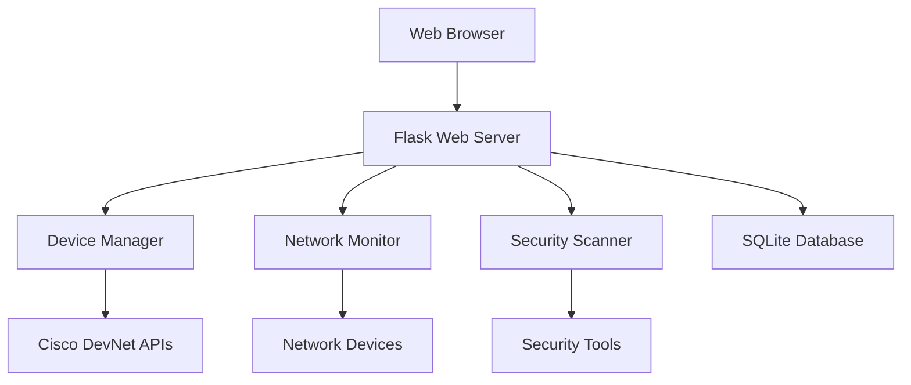

# 🏗️ System Architecture

## Overview
The Network Automation Dashboard follows a modern web application architecture with clear separation of concerns between frontend presentation, backend logic, and data persistence layers.

## High-Level Architecture



## Component Details

### Frontend Layer
- **Technologies**: HTML5, CSS3, JavaScript ES6+, Bootstrap 5
- **Frameworks**: Chart.js, vis.js for visualizations
- **Architecture**: Single Page Application (SPA) with AJAX updates
- **Responsive Design**: Mobile-first approach with responsive breakpoints

### Backend Layer
- **Framework**: Flask (Python)
- **Architecture**: MVC (Model-View-Controller) pattern
- **API Design**: RESTful API endpoints
- **Authentication**: Session-based authentication
- **Error Handling**: Comprehensive exception handling with logging

### Data Layer
- **Database**: SQLite for development, PostgreSQL for production
- **ORM**: SQLAlchemy for database abstraction
- **Caching**: In-memory caching for frequent operations
- **Data Models**: Normalized schema design

### Integration Layer
- **DevNet APIs**: Cisco Catalyst Center integration
- **Network Protocols**: SSH, NETCONF, RESTCONF, SNMP
- **Security Tools**: Nmap, custom vulnerability scanners
- **External APIs**: Third-party service integrations

## Security Architecture

### Authentication & Authorization
- Session-based authentication
- Role-based access control (RBAC)
- Password hashing with bcrypt
- CSRF protection

### Network Security
- Encrypted communications (SSH/TLS)
- Input validation and sanitization
- SQL injection prevention
- XSS protection

### Data Security
- Sensitive data encryption
- Secure credential storage
- Audit logging
- Data backup and recovery

## Deployment Architecture

### Development Environment
```bash
Local Development Server
├── Flask Development Server
├── SQLite Database
├── Mock DevNet Simulator
└── Debug Tools
```

### Production Environment
```bash
Production Stack
├── Nginx (Reverse Proxy)
├── Gunicorn (WSGI Server)
├── Flask Application
├── PostgreSQL Database
├── Redis Cache
└── Monitoring Tools
```

## API Design

### RESTful Endpoints
- **GET** operations for data retrieval
- **POST** operations for data creation
- **PUT** operations for data updates
- **DELETE** operations for data removal

### Response Format
```json
{
  "success": true,
  "data": {...},
  "message": "Operation completed successfully",
  "timestamp": "2024-01-01T12:00:00Z"
}
```

### Error Handling
```json
{
  "success": false,
  "error": "Error description",
  "error_code": "ERR_001",
  "timestamp": "2024-01-01T12:00:00Z"
}
```

## Performance Considerations

### Caching Strategy
- **Application Cache**: In-memory caching for frequent database queries
- **HTTP Cache**: Browser caching for static assets
- **API Cache**: Response caching for expensive operations

### Database Optimization
- **Indexing**: Strategic database indexes for query performance
- **Connection Pooling**: Efficient database connection management
- **Query Optimization**: Optimized SQL queries and ORM usage

### Frontend Optimization
- **Asset Minification**: Compressed CSS and JavaScript
- **Lazy Loading**: Progressive loading of large datasets
- **AJAX Updates**: Partial page updates instead of full reloads

## Scalability Design

### Horizontal Scaling
- **Load Balancing**: Multiple application instances
- **Database Scaling**: Read replicas and sharding
- **Caching Layer**: Distributed caching with Redis

### Vertical Scaling
- **Resource Optimization**: Efficient memory and CPU usage
- **Database Tuning**: Optimized database configuration
- **Application Profiling**: Performance monitoring and optimization

## Monitoring & Logging

### Application Monitoring
- **Health Checks**: Endpoint health monitoring
- **Performance Metrics**: Response time and throughput
- **Error Tracking**: Exception monitoring and alerting

### Infrastructure Monitoring
- **Server Metrics**: CPU, memory, disk usage
- **Network Monitoring**: Bandwidth and latency
- **Database Monitoring**: Query performance and connections

### Logging Strategy
- **Structured Logging**: JSON format for log aggregation
- **Log Levels**: Debug, Info, Warning, Error, Critical
- **Log Retention**: Configurable retention policies